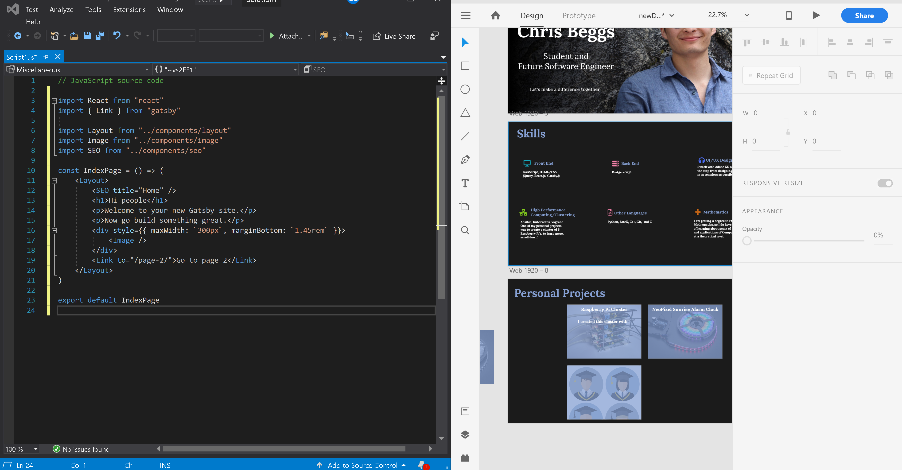
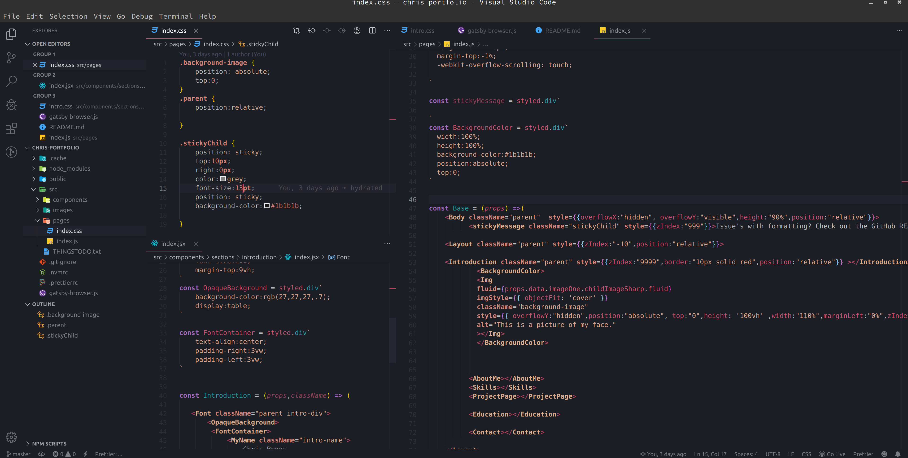

  

<h1 align="center">
  My Personal Portfolio created with Gatsby's default starter
</h1>

  
  

 
  <h3 margin="auto" >Site Current status: </h3>

*Hosted by Netlify*
 
 

Starting with a boilerplate provided by Gatsby.js, I built a personal portfolio!

